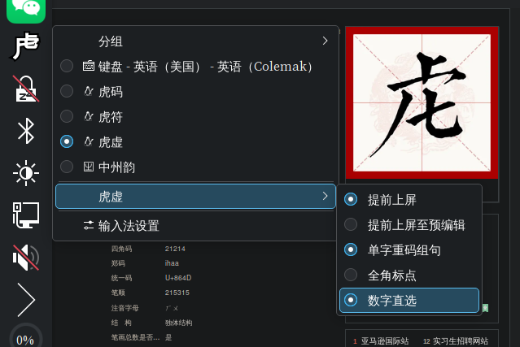
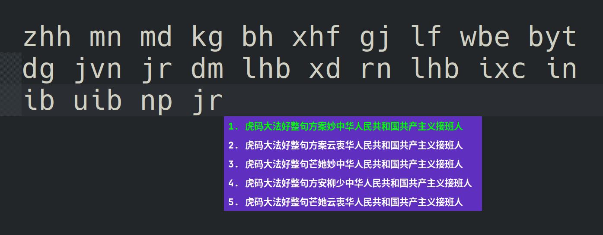
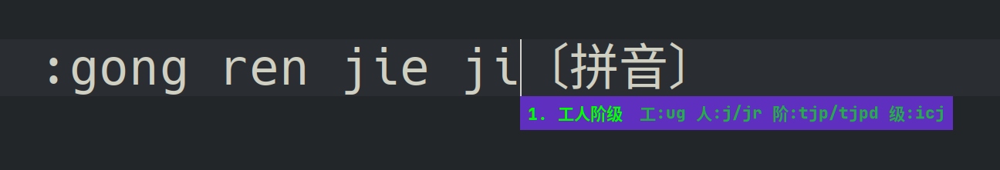
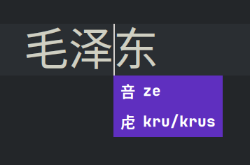

<!-- SPDX-FileCopyrightText: 2026 明雅流风 <crrvx@outlook.com> -->
<!-- SPDX-License-Identifier: GPL-3.0-or-later -->

# 虎虚输入法 / hux-ime

**虎句**（`tiger_sentence`）输入方案的 fcitx5 原生 Rust 实现。 \
计算与交互核心全部为 Rust，不依赖 librime。

> 本项目的语义、数据与金样均参照 [虎爪-rime](https://github.com/lvyww/tiger-sentense-rime)。 \
> hux-ime 属于社区方案，出于热爱而作，与上游无隶属关系。

just for fun:

| 名     | 解释                                                     |
| ------ | -------------------------------------------------------- |
| 英文名 | **hux** =  **hu**`虎码` + **tux**`linux(意指fcitx5方案)` |
| 中文名 | **虎虚** = **虎**`hux正取2字母` + **虚**`hux倒取2字母`   |
| 托盘图 | 虎虚虎虚，**虎内空虚**，故取 **虍**                      |
| 字反查 | **虍** 内取空，**咅** 也取空，对仗工整（                 |



## 快速指南

**一键安装**

```sh
git clone https://github.com/crrvx/hux-ime && cd hux-ime

# 预演：./install.sh --dry-run
./install.sh  # 构建 → 装插件与数据 → 重启 fcitx5
```

随后在 fcitx5 配置工具「添加输入法」→ **虎虚（hux）**。

**模型（可选，自取）**

n-gram 模型不随包，能明显提升整句质量： \
从 [上游 model release](https://github.com/lvyww/tiger-sentense-rime/releases/tag/model)
获取 `sentence-ngram-mobile.bin`，放入位置（二选一）：

- 用户级 `~/.local/share/fcitx5/hux/models/`（推荐）
- 系统级 `/usr/share/fcitx5/hux/models/`

不装也能使用，仅整句排序略弱。

**基本键位**

- `空格` 上屏高亮项；数字 `1`–`9` 直选当页候选（`0` = 第 10 个）
- `↑/↓` 或 `Tab / Shift+Tab` 选字；`←/→` 移动光标
- `-/=` 或 `[/]` 或 `PgUp/PgDn` 翻页；`Enter` 提交原文；`Esc` 取消
- `Alt+:` 音反查（拼音 → 虎码）；`Alt+"` 字反查（光标左侧汉字 → 拼音 + 虎码）
- 状态菜单「虎虚」：提前上屏、提前上屏至预编辑、单字重码组句、全角标点、数字直选







**一键卸载**

```sh
./uninstall.sh          # 保留用户数据（选项 / 学习库 / 模型）
./uninstall.sh --purge  # 连用户数据一起清除
```

更多细节见 [`docs/usage.md`](docs/usage.md)，配置项见 [`docs/config.md`](docs/config.md)。

## 文档

| 文档                                                       | 内容                                             |
| ---------------------------------------------------------- | ------------------------------------------------ |
| [`docs/usage.md`](docs/usage.md)                           | 开发 / 安装 / 使用 / 卸载                        |
| [`docs/config.md`](docs/config.md)                         | 配置项：行为 / 快捷键 / 选项与学习存储           |
| [`docs/rust-migration.md`](docs/rust-migration.md)         | 设计：路线与状态、模块映射、数据、集成要点       |
| [`docs/config-options.md`](docs/config-options.md)         | 待定：可配置项扩展（B/C 组记录）                 |
| [`docs/android.md`](docs/android.md)                       | 计划：fcitx5-android 插件适配                    |
| [`crates/hux-addon/README.md`](crates/hux-addon/README.md) | addon 实现：分工、按键语义、反查机制、已知限制   |
| [`goldens/README.md`](goldens/README.md)                   | 差分金样：清单、来源、复现命令                   |
| [`data/README.md`](data/README.md)                         | 随包数据说明                                     |

## 虎码信息汇总

- 虎码官网：[tiger-code.com](https://www.tiger-code.com)
- 虎码资源：[huma.ysepan.com](https://huma.ysepan.com)
- 虎句方案：
  - 官方 · [虎娘](https://github.com/lvyww/tigirl)
  - 官方 · [虎爪](https://github.com/lvyww/tigerclaw)
  - 官方 · [虎爪-rime](https://github.com/lvyww/tiger-sentense-rime)（本方案的参照实现）
  - 社区 · [虎符](https://github.com/LeafHW/hufu-ime-rust)
  - 社区 · [虎虚 hux](https://github.com/crrvx/hux-ime)（本方案）

## 致谢

特别感谢 [B佬（lvyww）](https://github.com/lvyww) 对 **虎码** 的发明！也感谢倾情虎码建设的各位同志！ \
若没有同志们的鼎力相助，就没有如今 **虎码** 在 **虎字、虎词、虎句** 等方案上的一路高歌，推陈出新！

## 署名

- 拼音数据 `data/tiger_sentence.pinyin.bin.gz` 转换自 [虎码官方秃版小狼毫](https://huma.ysepan.com)。
- 词先验数据 `data/tiger_sentence.lexical.bin`：[CC-BY-4.0](LICENSES/CC-BY-4.0.txt)
  派生自 [rime-mohu](https://github.com/fcxxxz/rime-mohu)； \
  署名见 [`docs/LEXICAL_PRIOR_ATTRIBUTION.md`](docs/LEXICAL_PRIOR_ATTRIBUTION.md)。
- 模型/码表/其他数据 `data/tiger_sentence.*`：[GPL-3.0](LICENSES/GPL-3.0-only.txt)
  取自 [tiger-sentense-rime](https://github.com/lvyww/tiger-sentense-rime)。

## 许可证

本项目代码以 「**GPL-3.0-or-later**」 发布，全文见 [`LICENSE`](LICENSE)。 \
（许可正文无法区分 only/or-later，见各文件 SPDX 头与 `Cargo.toml`） \
各文件的版权与许可经 SPDX 头 / [`REUSE.toml`](REUSE.toml) 标注（REUSE 规范），
许可正文见 [`LICENSES/`](LICENSES/)。
