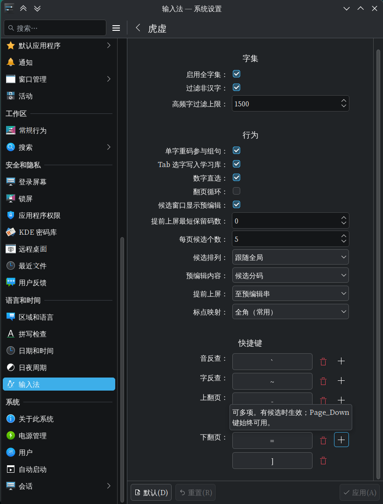

<!-- SPDX-FileCopyrightText: 2026 明雅流风 <crrvx@outlook.com> -->
<!-- SPDX-License-Identifier: GPL-3.0-or-later -->

# 配置项

配置入口：`fcitx5-configtool` → 「虎虚」页。 \
设置页分「行为」「快捷键」两个分区。 \
选项详情可悬浮查看，保存写入 `~/.config/fcitx5/conf/hux.conf`。

## 行为（布尔项在前，值选项在后）

| 项                   | 默认     | 说明                                        |
| -------------------- | -------- | ------------------------------------------- |
| 提前上屏             | 开       | 组合中证据成熟即提交当前候选                |
| 提前上屏至预编辑     | 关       | 提前上屏写入预编辑（缓冲，不直接提交）      |
| 单字重码参与组句     | 开       | 允许同一单字的重码候选参与整句解码          |
| 全角标点             | 关       | 标点输出全角（如 `/` -> `／`）              |
| ASCII 标点直通       | 关       | 标点不做中文映射，直接输出 ASCII            |
| Tab 选字写入学习库   | 开       | Tab 选字时记录学习事件并参与排序            |
| 数字直选             | 开       | `1`–`9` 上屏当页候选，`0` = 第 10 个        |
| 翻页循环             | 关       | **末页再下翻回首页**（参照 `menu/page_down_cycle` 只作用于下翻；首页上翻恒停首页并归零高亮，见下） |
| 候选窗口显示预编辑   | 开       | 仅宿主显示项，不经引擎；状态菜单「虎虚」里可就地切换 |
| 高频字过滤上限       | 1500     | 仅最优码组句的高频字上限（0=不限；重启生效）|
| 每页候选个数         | 5        | 1–10                                        |
| 候选排列             | 跟随全局 | 横排：↑↓ 选字、←→ 移动；竖排反之        |
| 预编辑内容           | 候选分码 | 候选分码（按词分段）/ 原始输入 / 不显示     |
| 提前上屏最短保留码数 | 0        | 0–20；与空码上屏共用，0 = 不额外限制        |

## 快捷键（`KeyList`，均可多项）

| 项              | 默认           | 说明                             |
| --------------- | -------------- | -------------------------------- |
| 音反查          | `` ` ``        | 拼音 -> 虎码                     |
| 字反查          | `~`            | 光标左侧汉字的拼音与虎码         |
| 上翻页 / 下翻页 | `-/=` 或 `[/]` | **菜单可见时上/下翻页同前置**：有候选（且非 `ascii_mode`）即判翻页并消费；PgUp/PgDn 始终可用。绑到此处的键在菜单可见时**优先翻页**（不被方案标点分支遮蔽——本仓有意偏离上游 `abad411`，见 [`upstream-deviations.md`](upstream-deviations.md) ①）；**代价（用户决定 B，2026-09）**：菜单可见时这几个键**不再能作为标点打出**（参照的 `when: paging`「已翻过页才生效」标签语义已按用户决定取消）；`ascii_mode` 或无菜单时仍按原路径落标点 |

反查触发键会被输入法消费：按下即进入反查（如 `` `zhongguo ``），不再作为普通字符输入。 \
`~` 是 Shift+`` ` `` 的字符，前端上报的是该 level 的 keysym（`asciitilde`），fcitx5 会去掉这种
「本身就产字符」键的 Shift，故默认值按无修饰的 `~` 声明；配置页里录到的也是同一形态。

配置文件 `~/.config/fcitx5/conf/hux.conf` 英文键名与 fcitx5 schema 对应。 \
快捷键为 fcitx5 `KeyList`，可配置多项；`AllowModifierLess` 允许无修饰键。 \
未显式提供的项跟随 fcitx5 全局设置（候选列表方向、客户端内联预编辑）。

## 选项与学习存储

- 选项：`~/.local/share/fcitx5/hux/tiger_sentence.options.yaml` \
  优先级：options.yaml > 设置 > 内建缺省；兼容只读回退 `user.yaml` 的 `var/option/*` \
  其中「提前上屏、提前上屏至预编辑、单字重码组句、全角标点、数字直选」也可在输入法状态菜单的
  「虎虚」子菜单切换（勾选即写入本文件）。
- 状态菜单「虎虚」子菜单除上面的选项开关外，还有三项**宿主项**（不写 `options.yaml`）：
  「候选窗口显示预编辑」（写 `conf/hux.conf`，切换即时生效）、
  「重新部署」（重读配置 + 重装数据与模型 + 重置全部会话，会话 id 不变）、
  以及一行模型信息 `模型：<文件名> — <状态>`。模型状态形如
  `已加载（三阶 TCSKNM02）` / `已加载（五阶 TCSKNM03）` / `未找到模型（整句排序退化为码表名次）` /
  `装载失败：<原因>`。
- 学习库：`~/.local/share/fcitx5/hux/tiger_sentence_learning_<hash>.userdb/` \
  （LevelDB 同构，可直接迁移）

## 待扩展（B/C 组）

> **来源**：原 `docs/config-options.md`（2026-09 文档重整并入本文并**删除该文件**；原文逐字保留，仅标题降一级）。
> **记录规则**：见本节末尾「记录规则」。

A 组四项（候选排列、预编辑内容、翻页循环、最短保留码数）已实施，见上文「行为」/「快捷键」两表。 \
本节记录**待定**项：低成本余项、中等成本（B）、高成本（C）与明确不做项，供后续排期选取。

### 1. 低成本余项（现管线只差暴露）

| 项 | 现状 | 实现点 | 备注 |
| --- | --- | --- | --- |
| 反查候选上限 | 固定 20 | 方案常量（`sound_to_char_shape::CANDIDATE_LIMIT`）→ 设置 + ABI `int` | 少用 |
| 学习库上限 | 固定 1 万条 / 16 MiB | `learning_store` 常量 → 设置（重启生效） | 少用；「清空学习库」需另做动作，非配置 |
| 候选序号显示 | 随数字直选联动（直选开启才显示 `1`–`9`/`0`） | C++ `setSelectionKey` 条件 → 三态设置 | 少用 |

### 2. B 组（中等成本，可排期）

#### B1 模型路径（`ModelPath`）
- **价值**：自定义/禁用 n-gram 模型；Android 模型分发后续也依赖「模型路径」能力（模型 APK 走默认目录）。
- **现状**：仅 `HUX_MODEL` 环境变量；模型在引擎创建时加载（修改需重启）。
- **实现**：schema `String` → ABI 传路径（缺省/空串语义待定：空 = 默认查找还是禁用）；与 `HUX_MODEL` 的优先级约定。
- **成本/风险**：中 / 低（重启生效；输出随模型版本变化）。

#### B2 候选选择键可配置
- **价值**：除 Tab/Shift+Tab、Up/Down 外可自定义选字键。
- **现状**：host `key_binder` 固定 Tab/Shift+Tab；`selector` 固定 Up/Down（横排）/ ←→（竖排）。
- **实现**：`HostOptions` 增 `prev/next_candidate_keys`（rime 键名，`KeyList` 可多项），`selector` 按列表匹配；
  与翻页键、导航键在现有处理器链中的优先级需一并理清。
- **成本/风险**：中 / 低（沿用「有候选时生效」语义）。

#### B3 普通候选显示虎码注释
- **价值**：打字时候选旁显示虎码（学码友好）。
- **现状**：普通解码候选 `comment` 为空；音反查候选注释 = 虎码。
- **实现**：注释来源（候选路径的编码/词条虎码）；显示格式与宽度；仅展示层换算，**不得进入排序**（差分金样不受影响）。
- **成本/风险**：中 / 中。

#### B4 码表 / 标点表自定义
- **现状**：**用户目录同名文件覆盖已可用**（`$XDG_DATA_HOME/fcitx5/hux/`，缺省 `~/.local/share/fcitx5/hux/`，
  放 `tiger_sentence.*.txt` 或 `symbols.yaml` 即生效），无需代码。
- **路线**：先补文档（`usage.md` / `data/README.md`）；若需 UI 指定路径（`String` 项 + 重启）再排期。
- **成本**：文档 = 小；UI = 中。

### 3. C 组（高成本，暂缓）

#### C1 简繁转换
- **价值**：输出简/繁切换（参照未带，属扩展）。
- **前置**：OpenCC 级转换表（体积 / 许可 / 来源）；转换挂点（提交文本与候选文本）；与学习库、反查展示的交互契约。
- **成本/风险**：高（数据 + 全链路）。

#### C2 用户词 / 自造词
- **价值**：用户词典导入导出、编辑；学习过程可见化。
- **现状**：只有打分式学习库（LevelDB 同构），无用户词层。
- **前置**：数据结构与迁移、与解码排序/学习的关系、桌面与 Android 两端 UI。
- **成本/风险**：高。

### 4. 明确不做
- 早提交概率阈值（share / 证据数）：调参危险，参照亦未暴露为 UI；
- `memory_profile`（compact/balanced）：本实现仅支持 TCSKNM02 mobile 模型；
- `ascii_composer` 系列（Caps/Shift 行为）：无内置英文模式。

### 5. 记录规则
- 新想法先落本表（价值 / 现状 / 实现点 / 成本），低风险小项可随时转实施；
- 实施后从本表移除，同步本文件「行为 / 快捷键」两表、测试与相关文档。
