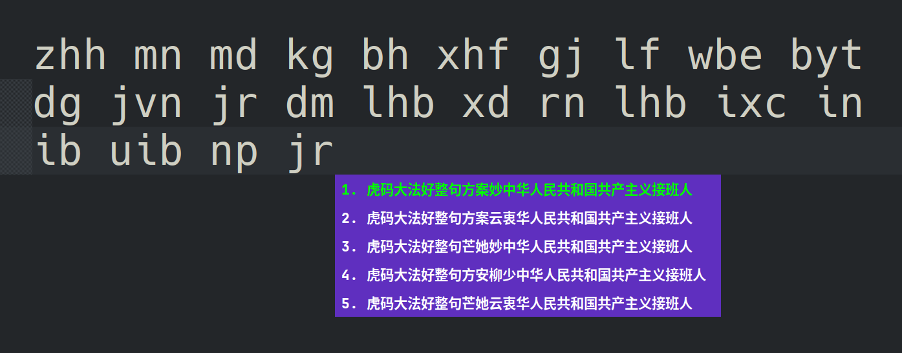
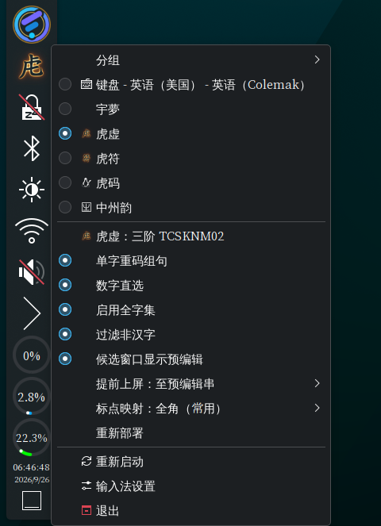
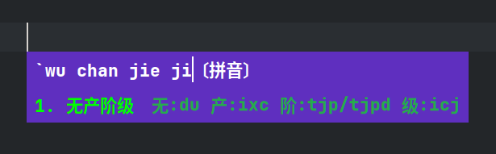
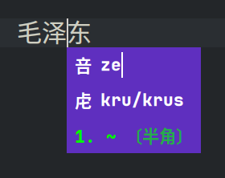

<!-- SPDX-FileCopyrightText: 2026 明雅流风 <crrvx@outlook.com> -->

<!-- SPDX-License-Identifier: GPL-3.0-or-later -->

# 使用

构建 / 安装 / 卸载见 [`install.md`](install.md)。

- `←/→` 移动光标
- `↑/↓` 或 `(Shift +) Tab` 候选切换
- 数字直选、`;` 次选、`'` 三选
- `PgUp/PgDn` 或 `[/]` 翻页
- `空格` 或点击上屏高亮项、`Enter` 提交原文、`Esc` 取消
- `` ` `` 音反查（拼音 → 虎码）、`~` 字反查（光标左字 → 拼音 + 虎码）



配置项见 [`config.md`](config.md)（配置工具「虎虚」页）。

托盘右键菜单：

1. 首项「**虎虚**」：点击进入模型目录
2. 「**提前上屏**」子菜单：关闭 / 至输出 / 至预编辑串
3. 「**标点映射**」子菜单：关闭（半角）/ 全角（常用）/ 全角（all）
4. 「**重新部署**」及其他项：即时生效



## 音反查

输入拼音（支持缩写），候选为字词，注释即虎码。

- `'` 作**音节分隔符**（消歧用）：比如`` `xi'an`` 按 `xi` + `an` 切分
- `Esc` / 再次触发 / 输入其它键：退出

```
`  zhongguo   →   `zhong guo〔拼音〕   候选：中国 …
`  zh'guo     →   `zh'guo〔拼音〕      候选：中国 …
```



## 字反查

面板显示光标左侧 1 个字：上排拼音「**咅**」、下排虎码「**虍**」。

- `方向键` 移动应用光标（信息随光标刷新）
- `Esc` / 再次触发 / 输入其它键：退出

```
中：
咅 zhong
虍 d/dg/dgs
```



## 图标与托盘显示

两处常见困惑：

- **托盘显示 “文字「虍」” 而非 “图标「虍」”**：取消该勾选
  - 路径：fcitx5-configtool →「附加组件」→「经典界面」→「优先使用文字图标」
- **重装后托盘仍是旧图标**：
  - 原因：Qt 系程序（面板、fcitx5）缓存像素图，替换不会重读
  - 需重启桌面面板：`kquitapp6 plasmashell && kstart plasmashell` 或注销重登
  - GTK 侧：必要时 `sudo gtk-update-icon-cache -f -t /usr/share/icons/hicolor`
  - 可能未成功替换，请核对 sha256sum
    - 落盘：`/usr/share/icons/hicolor/*/apps/hux.*`
    - 与 `assets/branding/` 同名文件比对
  - `install.sh` 已尽力刷新 `icon-theme.cache`
